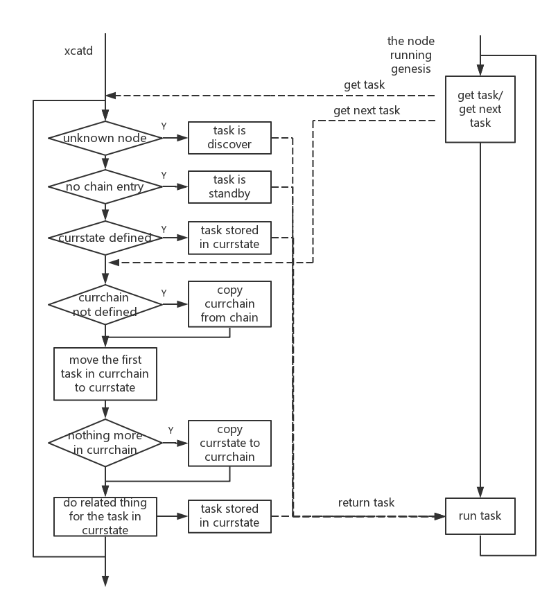

Understanding chain table
=========================

The chain table (``tabdump chain``) is an xCAT database table that holds the chain configuration. The following attributes can be defined to perform the chain function: ::

 * currstate
 * currchain
 * chain

To know how are those three attributes used, reference the picture: 

 

