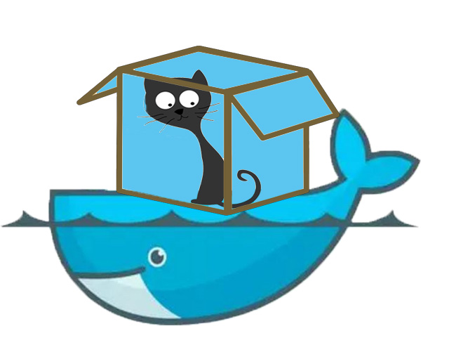

Dockerized xCAT
================

Overview
--------

`Docker <https://www.docker.com/>`_ is a popular containment environment making it easier to create, deploy, and run applications/services. With Docker, applications/services are shipped as **Docker images** and run in **Docker containers**. **Docker containers** include the application/services and all of its running environment, which have isolated namespace and network stack but share the kernel on the host operating system. The server on which  **Docker containers** run is called **Docker host**. **Docker image** can only run on **Docker host** with the same architecture.

**Compose** is a native tool shipped by Docker to define and run applications in Docker containers. You use a Compose file to configure your applications/services. Then, using a single command, you create and start all the services from your configuration.  

By pulling xCAT Docker image and running xCAT Docker image in a container, you get a well-configured xCAT Management Node to start cluster management work, without worrying about the xCAT installation and configuration on different OS and various hardware platforms.

xCAT Docker images
------------------

xCAT ships 2 Docker images for Docker host with different architecture: 

* "xcat/xcat-ubuntu-x86_64": run on x86_64 Docker host
* "xcat/xcat-ubuntu-ppc64le": run on ppc64le Docker host 

Each of the xCAT Docker images above has 3 tags corresponding to different xCAT release inside Docker image:

* "latest" : the latest xCAT release
* "2.11"   : xCAT 2.11 release
* "dev"    : the latest xCAT development snapshot build

A Docker image with specified tag should be denoted in format "[docker image name]:[tag]", for example, "xcat/xcat-ubuntu-x86_64:2.11". If not specified, default tag is "latest".

Run xCAT in Docker
------------------

Each container with xCAT Docker image running inside is a xCAT management node, the container connects to the compute nodes and hardware control points in the cluster via "bridge" network on the Docker host. Generally, a xCAT container should connect to 2 types of networks( the 2 types of networks might be one network in some cluster):

* "mgtnet": Management network, the network used by the Management Node to install operating systems and manage the nodes. The Management Node and in-band Network Interface Card (NIC) of the nodes are connected to this network. A bridge "mgtbr" will be created and attached to the network interface facing the compute nodes on Docker host
* "svcnet": Service network, the network used by the Management Node to control the nodes using out-of-band management using the Service Processor. A bridge "svcbr" will be created and attached to the network interface facing the hardware control points 

You are required to determine and specify some necessary information, so that xCAT is well configured and running when the container is started. This includes:

* Docker container: xCAT Docker image with specified xCAT release; the data volumes with directories on Docker host including xCAT DB tables, the osimage resources and xCAT logs, which can be used to save and restore the data of xCAT service
* network information: the network configuration of the xCAT container
* cluster information: the domain of the cluster

The information can be specified in 2 ways to run xCAT container: 

* in options and arguments of docker commands such as ``docker network create`` or ``docker run``
* in the "docker-compose.yml", which contains all the configuration to start xCAT containers with Compose. This is the recommended way to start xCAT container.

The 2 ways are described step-by-step in the following sections of this documentation. We recommend you start xCAT container with Compose.

When xCAT Docker container is started, you can access it with ``sudo docker attach``, however, we recommend you to access it via "ssh".

.. toctree::
   :maxdepth: 2

   setup_docker_host.rst 
   run_xcat_in_docker_compose.rst
   run_xcat_in_docker_native.rst

Work with xCAT
--------------

Once xCAT Docker container is running, you can use xCAT with the shell inside the container. Since the ssh service has been enabled on the Docker container startup, you can connect to the container via ssh. The default root password is "cluster".

Once you attach or ssh to the container, you will find that xCAT is running and configured, you can play with xCAT and manage your cluster now. 

Currently, since xCAT can only generate the diskless osimages of Linux distributions with the same OS version and architecture with xCAT MN. If you need to provision diskless osimages besides ubuntu x86_64 with xCAT running in the Docker, you can use ``imgexport`` and ``imgimport`` to import the diskless osimages generated before.

If you start up the xCAT Docker container by following the steps described in sections above strictly, without specifying "--dns=IP_ADDRESS...", "--dns-search=DOMAIN...", or "--dns-opt=OPTION..." options, Docker uses the /etc/resolv.conf of the host machine (where the docker daemon runs). Any DNS problem inside container, make sure the DNS server on the Docker host works well.

Save and Restore xCAT data 
----------------------------

According to the policy of Docker, Docker image should only be the service deployment unit, it is not recommended to save data in Docker image. Docker uses "Data Volume" to save persistent data inside container, which can be simply taken as a shared directory between Docker host and Docker container. 

For dockerized xCAT, there are 3 volumes recommended to save and restore xCAT user data.

* "/install":        save the osimage resources under "/install" directory 
* "/var/log/xcat/":  save xCAT logs 
* "/.dbbackup":      save and restore xCAT DB tables. You can save the xCAT DB tables with ``dumpxCATdb -p /.dbbackup/`` inside container and xCAT will restore the tables on the container start up.

