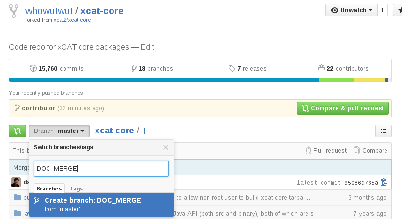

Creating Branches
=================

**Note:** To more easily keep the forked repository and upstream repositories in sync, we recommended that you keep your master branch free from changes and create branches to contain the changes in function you are working on.

Local Branches
--------------

Git branches are very light weight and easy to create.  Simply use the ``git branch <branch_name>`` command. 

Since we are using pull requests to merge changes back to the upstream project, you will need to have your changes committed to a branch on GitHub (calling this a "remote branch") so that GitHub can detect differences and pull requests can be created.

Remote Branches
---------------

Reference articles: 
* http://www.gitguys.com/topics/adding-and-removing-remote-branches/

From GitHub
^^^^^^^^^^^

* Under your repository, click on the **Branch** dropdown and type in a name for the new branch, then hit enter.

  In the example below, creating a new branch off 'master' called ``DOC_MERGE``

* Since we created the branch from the UI, a refresh needs to be done in order to see the new branch.  Refresh by fetching from the origin repository: ::

        $ git fetch origin
        Enter passphrase for key '/home/vhu/.ssh/github/id_rsa': 
        From github.com:whowutwut/xcat-doc
         * [new branch]      DOC_MERGE  -> origin/DOC_MERGE

* Show the remote branches: ``git branch -r`` ::

        $ git branch -r
          origin/HEAD -> origin/master
          origin/large_cluster
          origin/master
          origin/DOC_MERGE  <=== NEW BRANCH
          origin/sync
          upstream/master

From Command Line (CLI)
^^^^^^^^^^^^^^^^^^^^^^^

* Create a branch: ::

      $ git branch
      * master

      $ git branch skeleton 

      $ git branch 
      * master
        skeleton

* Push the newly created branch to origin (on GitHub): ::

      $ git push origin skeleton 
      Enter passphrase for key '/home/vhu/.ssh/github/id_rsa': 
      Total 0 (delta 0), reused 0 (delta 0)
      To git@github.com:whowutwut/xcat-doc.git
       * [new branch]      skeleton -> skeleton

  Verify that the branch is there by looking at the remote branches: :: 

      $ git branch -r
        origin/HEAD -> origin/master
        origin/master
        origin/skeleton   <=== HERE IT IS 
        upstream/master

