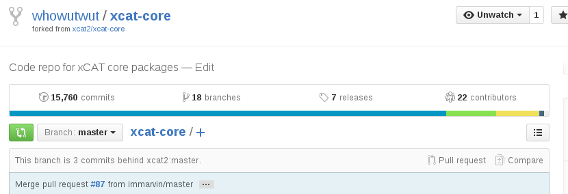
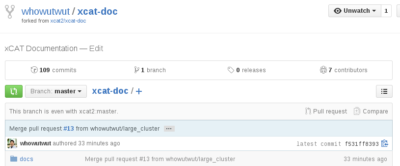

Syncing a Fork
==============

**Note:** *The examples below all reference the master branch*

Before the Syncing
------------------

References: https://help.github.com/articles/syncing-a-fork/

From time to time, your master branch will start to **fall behind** the upstream/master because changes are being pulled into the ``xcat2/xcat-core`` project from other developers. 

Temporarily Stashing work (optional)
------------------------------------

If working on changes in another branch, it's recommended to stash the work before switching to the ``master`` branch so the pull does not wipe out any uncommitted changes.  To stash work in the current branch:

#. Add (*not commit*) any untracked files and directories: ::

    $ git add <untracked_files_and_directories>

#. Stash the work: ::

    $ git stash

Switch and Update the **master branch** of your forked copy
-----------------------------------------------------------

#. Switch to the master branch. ::

    $ git checkout master

#. Pull the commits from the ``upstream master`` (xcat2/xcat-core) to your local master branch. ::

    $ git pull upstream master
    remote: Counting objects: 38, done.
    remote: Compressing objects: 100% (15/15), done.
    remote: Total 38 (delta 14), reused 9 (delta 9), pack-reused 14
    Unpacking objects: 100% (38/38), done.
    From github.com:xcat2/xcat-core
     * branch            master     -> FETCH_HEAD
       8f0cb07..d0651b5  master     -> upstream/master
    Updating 8f0cb07..d0651b5
    Fast-forward
    ...

#. Push the commits from ``upstream`` merged to your local master to your forked copy in GitHub: ::

    $ git push origin master

After the Syncing
-----------------

Your fork master branch should now be **even** with ``xcat2/xcat-core``

Unstashing work (optional)
--------------------------

If work has been stashed, to continue back where you left off, switch to the target branch and run : ``git stash pop``

