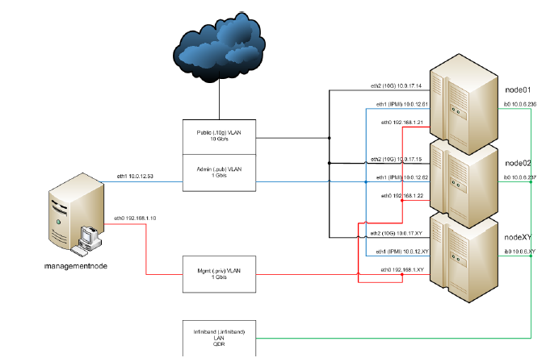

Configure xCAT
==============

Networks Table
---------------

All networks in the cluster must be defined in the networks table. When xCAT was installed, it ran makenetworks, which created an entry in this table for each of the networks the management node is connected to. Now is the time to add to the networks table any other networks in the cluster, or update existing networks in the table.

For a sample Networks Setup, see the following example:

And the following table shows all network IP addresses of the cluster:

**Network Table**

+------------------------------+---------------+------------------------------------------------+
|Machine name                  | IP Address    | Alias                                          |
+==============================+===============+================================================+
|managementnode.pub.site.net   | 10.0.12.53    | managementnode.site.net                        |
+------------------------------+---------------+------------------------------------------------+
|managementnode.priv.site.net  | 92.168.1.10   |                                                | 
+------------------------------+---------------+------------------------------------------------+     
|node01.pub.site.net           | 10.0.12.61    |                                                |
+------------------------------+---------------+------------------------------------------------+     
|node02.pub.site.net           | 10.0.12.62    |                                                |
+------------------------------+---------------+------------------------------------------------+  
|node01.infiniband.site.net    | 10.0.6.236    |                                                |
+------------------------------+---------------+------------------------------------------------+      
|node02.infiniband.site.net    | 10.0.6.237    |                                                |
+------------------------------+---------------+------------------------------------------------+   
|node01.10g.site.net           | 10.0.17.14    | node01.site.net                                |
+------------------------------+---------------+------------------------------------------------+
|node02.10g.site.net           | 10.0.17.15    | node02.site.net                                |
+------------------------------+---------------+------------------------------------------------+
|node01.priv.site.net          | 192.168.1.21  |                                                |
+------------------------------+---------------+------------------------------------------------+
|node02.priv.site.net          | 192.168.1.22  |                                                |                           
+------------------------------+---------------+------------------------------------------------+

All networks in the cluster must be defined in the networks table which can be modified with the command ``chtab``, ``chdef`` or with the command ``tabedit`` .

The xCAT  installation ran the command ``makenetworks`` which created the following entry: ::

    # tabdump networks
    #netname,net,mask,mgtifname,gateway,dhcpserver,tftpserver,nameservers,ntpservers,logservers,dynamicrange,nodehostname,comments,disable
    "10_0_12_0-255_255_255_0","192.168.1.0","255.255.255.0","eth1"
    ,,,"192.168.1.10","10.0.12.10,10.0.17.10",,,,,,
    "192_168_1_0-255_255_255_0,"10.0.12.0","255.255.255.0","eth0"
    ,,,"10.0.12.53","10.0.12.10,10.0.17.10",,,,,,

Update the private network of this table as follow: ::

    # chdef -t network -o "pvtnet" net=192.168.1.0 mask=255.255.255.0 mgtifname=eth0\
    dhcpserver=192.168.1.10 tftpserver=192.168.1.10\
    nameservers=10.0.12.10,10.0.17.10\
    dynamicrange=192.168.1.21-192.168.1.22

Disable the entry for the public network: ::

    # chtab net=10.0.12.0 networks.disable=1
    # tabdump networks
    #netname,net,mask,mgtifname,gateway,dhcpserver,tftpserver,nameservers,ntpservers,  -
    logservers,dynamicrange,nodehostname,comments,disable
    "10_0_12_0-255_255_255_0","10.0.12.0","255.255.255.0","eth1",,,
    "10.0.12.53","10.0.12.10,10.0.17.10",,,,,,"1" 
    "pvtnet","192.168.1.0","255.255.255.0","eth0",,
    "192.168.1.10","192.168.1.10","10.0.12.10,10.0.17.10",,,"192.168.1.21-192.168.1.22",,,,,,

passwd Table
------------

The password should be set in the passwd table that will be assigned to root when the node is installed. You can modify this table using tabedit. To change the default password for root on the nodes, change the system line. To change the password to be used for the BMCs (x-series only), change the ipmi line. ::

   tabedit passwd
   #key,username,password,cryptmethod,comments,disable
   "system","root","cluster",,,
   "hmc","hscroot","ABC123",,,

Setup DNS
----------
To get the hostname/IP pairs copied from /etc/hosts to the DNS on the MN: ::

    Ensure that /etc/sysconfig/named does not have ROOTDIR set

    Set site.forwarders to your site-wide DNS servers that can resolve site or public hostnames. The DNS on the MN will forward any requests it can't answer to these servers.

    chdef -t site forwarders=1.2.3.4,1.2.5.6

    Edit /etc/resolv.conf to point the MN to its own DNS. (Note: this won't be required in xCAT 2.8 and above.)

    search cluster
    nameserver 172.20.0.1

    Run makedns

    makedns -n

For more information about name resolution in an xCAT Cluster, see [Cluster_Name_Resolution].To Do

Setup TFTP
-----------

Nothing to do here - the TFTP server is done by xCAT during the Management Node install.

Setup DHCP
----------

(Optional)Setup the DHCP interfaces in site table

To set up the site table dhcp interfaces for your system p cluster, identify the correct interfaces that xCAT should listen to on your management node and service nodes: ::

     chdef -t site dhcpinterfaces='pmanagenode|eth1;service|eth0'

Initialize DHCP service
~~~~~~~~~~~~~~~~~~~~~~~

Create a new dhcp configuration file with a network statement for each network the dhcp daemon should listen on. ::

     makedhcp -n
     service dhcpd restart

(Optional)Setup the DHCP interfaces in site table
~~~~~~~~~~~~~~~~~~~~~~~~~~~~~~~~~~~~~~~~~~~~~~~~~

To set up the site table dhcp interfaces for your system p cluster, identify the correct interfaces that xCAT should listen to on your management node and service nodes: ::

     chdef -t site dhcpinterfaces='pmanagenode|eth1;service|eth0'
     makedhcp -n
     service dhcpd restart

Discover and Define Your System p Hardware
~~~~~~~~~~~~~~~~~~~~~~~~~~~~~~~~~~~~~~~~~~~

The next steps are to discover your hardware on the nextwork, defined it in the xCAT database, configure xCAT's hardware control, and do the initial definition of the LPARs as the compute nodes. These steps are explained in the following 2 documents. Use the one that applies to your environment:

    For DFM managed system p cluster, use XCAT System p Hardware Management for HMC Managed Systems
    For HMC managed system p cluster, use xCAT System p Hardware Management for DFM Managed Systems

After performing the steps in one of those documents, return here and continue on in this document.
Setting up a Linux Hierarchical Cluster

For large clusters, you can distribute most of the xCAT services from the management node to xCAT service nodes. Doing so, creates a "hierarchical cluster". The following document describes additional xCAT management node configuration for a Linux Hierarchical Cluster, how to install your service nodes, and how to configure your compute nodes to be managed by service nodes.

[Setting_Up_a_Linux_Hierarchical_Cluster]

Setting up a hierarchical cluster assumes more advanced knowledge of xCAT node definition, deployment, and management. If this is your first time setting up an xCAT cluster, you should skip this step for now and experiment with a simple cluster managed directly from your xCAT management node to become familiar with all the different concepts and processes.
Complete the Definition of the Compute Nodes

The hardware management documents explained how to get the LPARs of the CECs defined as nodes in the xCAT database. Before deploying an OS on the nodes, you must set some additional attributes of the nodes.

Configure DHCP
~~~~~~~~~~~~~~

Add the defined nodes into the DHCP configuration: ::

     makedhcp pnode1

Restart the dhcp service: ::

     service dhcpd restart

Define xCAT groups
------------------

See the following Node Group Support,for more details on how to define xCAT groups. For the example below add the compute group to the nodes. ::

    chdef -t node -o pnode1,pnode2 -p groups=compute

Update the attributes of the node ::

    chdef -t node -o pnode1 netboot=yaboot tftpserver=192.168.0.1 nfsserver=192.168.0.1
    monserver=192.168.0.1 xcatmaster=192.168.0.1 installnic=mac primarynic=mac

Note:

* Make sure the attributes "installnic" and "primarynic" are set up by the correct Ethernet or HFI Interface of compute node. Otherwise the compute node installation may hang on requesting information from an incorrect interface. The "installnic" and "primarynic" can also be set to mac address if you are not sure about the Ethernet interface name, the mac address can be got through getmacs command. The installnic" and "primarynic" can also be set to keyword "mac", which means that the network interface specified by the mac address in the mac table will be used.

* Make sure that the address used above ( 192.168.0.1) is the address of the Management Node as known by the node. Also make sure site.master has this address.

* Make sure the attributes "netboot" is set correctly according to the OS and hardware platform: ::

   "pxe" or "xnba": for X86* platform;
   "yaboot": for IBM Power platform;
   "grub2-tftp" or "grub2-http": for IBM Power LE platform, Redhat7.x and newer Redhat family on Power BE platform. The difference between the 2 is the file transfer protocol of grub2 to fetch the os kernel and initrd;
   "grub2": same as "grub2-tftp" to keep backward compatibility.

**RHEL 7 Notes** 

* If you are using RHEL7, "yaboot" is deprecated, the netboot method for system P must be set to "grub2". ::

    chdef -t node -o pnode1 netboot=grub2

* Redhat 7 provides methods for consistent and predictable network device naming for network interfaces. These features change the name of network interfaces from traditional "eth[0...9]" to predictable network device names, see **CONSISTENT NETWORK DEVICE NAMING**. In case you need to preserve the "ethX" naming scheme, please specify the option "net.ifnames=0" in "addkcmdline" attribute of node or osimage to prevent the consistent network device renaming. ::

    chdef -t node -o pnode1 -p addkcmdline=net.ifnames=0

Setup conserver
---------------

    ``makeconservercf``

Configure conserver
~~~~~~~~~~~~~~~~~~~

The xCAT ``rcons`` command uses the conserver package to provide support for multiple read-only consoles on a single node and the console logging. For example, if a user has a read-write console session open on node node1, other users could also log in to that console session on node1 as read-only users. This allows sharing a console server session between multiple users for diagnostic or other collaborative purposes. The console logging function will log the console output and activities for any node with remote console attributes set to the following file which an be replayed for debugging or any other purposes: ::

    /var/log/consoles/<node_name>

Note: /var/log/consoles/<node_name> is the default console logging file, could be changed through updating the "logfile" attribute in /etc/conserver.cf

Update conserver configuration
''''''''''''''''''''''''''''''

Each xCAT node with remote console attributes set should be added into the conserver configuration file to make the rcons work. The xCAT command makeconservercf will put all the nodes into conserver configuration file **/etc/conserver.cf**. The makeconservercf command must be run when there is any node definition changes that will affect the conserver, such as adding new nodes, removing nodes or changing the nodes' remote console settings.

To add or remove new nodes for conserver support: ::

    makeconservercf
    service conserver stop
    service conserver start

Check rcons
'''''''''''

The functions rnetboot and getmacs depend on conserver functions, check it is available. ::

    rcons pnode1

If it works ok, you will get into the console interface of the pnode1. If it does not work, review your rcons setup as documented in previous steps.
Check hardware control setup to the nodes

See if you setup is correct at this point, run rpower to check node status: ::

    rpower pnode1 stat

Update the mac table with the address of the node(s)

Before run getmacs, make sure the node is off. The reason is the HMC may not be able to shutdown linux nodes which are in running state.

You can force the lpar shutdown with: ::

    rpower pnode1 off

Run the getmacs command with -D flag to get the mac address of the system p node: ::

    getmacs -D pnode1

The ``getmacs -D`` command will reboot the nodes to openfirmware console and input openfirmware commands to list the network adapters, and then use the ping test to try which network adapter is connected to the management node. This is a time consuming process and does not handle the scalability configuration well, if the system p nodes are managed through DFM and the nodes only have virtual network adapters(LHEA and SEA), use getmacs command without -D will make the process be much quicker, but the only problem is that getmacs will not be able to know which network adapter could be used to connect to the management node.

    getmacs pnode1

The output looks like following: ::

    pnode1:
    Type Location Code MAC Address Full Path Name Ping Result Device Type
    ent U9133.55A.10E093F-V4-C5-T1 f2:60:f0:00:40:05 /vdevice/l-lan@30000005 virtual

And the Mac address will be written into the xCAT mac table. Run to verify: ::

    tabdump mac

(Optional)Set up customization scripts
--------------------------------------

xCAT supports the running of customization scripts on the nodes when they are installed. You can see what scripts xCAT will run by default by looking at the xcatdefaults entry in the xCAT postscripts table. The postscripts attribute of the node definition can be used to specify the comma separated list of the scripts that you want to be executed on the nodes. The order of the scripts in the list determines the order in which they will be run.

To check current postscript and postbootscripts setting: ::

    tabdump postscripts

For example, if you want to have your two scripts called foo and bar run on node node01 you could add them to the postscripts table: ::

    chdef -t node -o node01 -p postscripts=foo,bar

For more information on creating and setting up customization scripts: [Postscripts_and_Prescripts]
