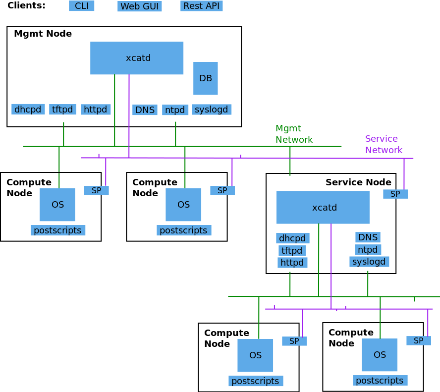

Architecture
============

The following diagram shows the basic structure of xCAT:

xCAT Management Node (xCAT Mgmt Node):
  The server where xCAT software is installed and used as the single point to perform system management over the entire cluster.  On this node, a database is configured to store the xCAT node definitions.  Network services (dhcp, tftp, http, etc) are enabled to respond in Operating system deployment.

Service Node:
  One or more defined "slave" servers operating under the Management Node to assist in system management to reduce the load (cpu, network bandwidth) when using a single Management Node.  This concept is necessary when managing very large clusters.

Compute Node:
  The compute nodes are the target servers which xCAT is managing.

Network Services (dhcp, tftp, http,etc):
  The various network services necessary to perform Operating System deployment over the network.  xCAT will bring up and configure the network services automatically without any intervention from the System Administrator.

Service Processor (SP):
  A module embedded in the hardware server used to perform the out-of-band hardware control. (e.g. Integrated Management Module (IMM), Flexible Service Processor (FSP), Baseboard Management Controller (BMC), etc) 

Management network:
  The network used by the Management Node (or Service Node) to install operating systems and manage the nodes.  The Management Node and in-band Network Interface Card (NIC) of the nodes are connected to this network.   If you have a large cluster utilizing Service Nodes, sometimes this network is segregated into separate VLANs for each Service Node.  
Service network:
  The network used by the Management Node (or Service Node) to control the nodes using out-of-band management using the Service Processor.  If the Service Processor is configured in shared mode (meaning the NIC of the Service process is used for the SP and the host), then this network can be combined with the management network.

Application network:
  The network used by the applications on the Compute nodes to communicate among each other.

Site (Public) network:
  The network used by users to access the Management Nodes or access the Compute Nodes directly.

RestAPIs:
  The RestAPI interface can be used by the third-party application to integrate with xCAT.

