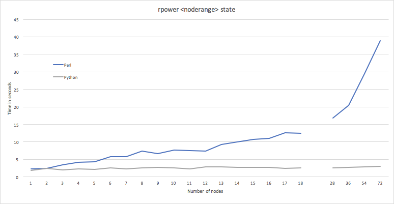

Performance
===========

Supported Commands
------------------

The following commands are currently supported:

+----------------+-----------+-------------+----------------------------------+
|Command         |Support    |Release      |Notes                             |
+================+===========+=============+==================================+
| rpower         | Yes       | 2.13.11     |                                  |
+----------------+-----------+-------------+----------------------------------+
| rinv           | Yes       | 2.13.11     |                                  |
+----------------+-----------+-------------+----------------------------------+
| rbeacon        | Yes       | 2.13.11     |                                  |
+----------------+-----------+-------------+----------------------------------+
| rspconfig      | No        | 2.14        |                                  |
+----------------+-----------+-------------+----------------------------------+
| rsetboot       | Yes       | 2.13.11     |                                  |
+----------------+-----------+-------------+----------------------------------+
| rvitals        | Yes       | 2.13.11     |                                  |
+----------------+-----------+-------------+----------------------------------+
| rflash         | No        |             |                                  |
+----------------+-----------+-------------+----------------------------------+
| reventlog      | No        | 2.14        |                                  |
+----------------+-----------+-------------+----------------------------------+


Data
----

The following graph shows performance gains in the Python code implementation of ``mgt=openbmc`` when compared to the Perl implementation.

rpower <noderange> state
````````````````````````

This chart gathers data points on a single 18-node frame, up to 4 frames (72-nodes).


